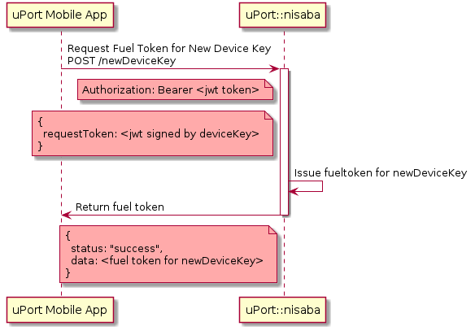

# lambda-nisaba
_(Sumerian) Nisaba was the Sumerian goddess of writing, learning, and the harvest_

Lambda functions for verifying phone numbers

[](https://circleci.com/gh/uport-project/lambda-nisaba)

[](https://codecov.io/gh/uport-project/lambda-nisaba)


[Diagrams](./diagrams/README.md)

## Repository Basics

### Description
Nisaba provides user verification for the uPort ecosystem.

### What is [AWS Lambda](https://aws.amazon.com/lambda/)?
AWS Lambda lets you run code without provisioning or managing servers. You pay only for the compute time you consume - there is no charge when your code is not running.

With Lambda, you can run code for virtually any type of application or backend service - all with zero administration. Just upload your code and Lambda takes care of everything required to run and scale your code with high availability. You can set up your code to automatically trigger from other AWS services or call it directly from any web or mobile app.

### What is [Serverless](https://serverless.com/learn/)?
Just like wireless internet has wires somewhere, serverless architectures still have servers somewhere. What ‘serverless’ really means is that, as a developer you don’t have to think about those servers. You just focus on code.

### Serverless Architectures with AWS Lambda
Using AWS Lambda as the logic layer of a serverless application can enable faster development speed and greater experimentation – and innovation — than in a traditional, server-based environment. Many serverless applications can be fully functional with only a few lines of code and little else.

Examples of fully-serverless-application use cases include:

- Web or mobile backends – Create fully-serverless, mobile applications or websites by creating user-facing content in a native mobile application or static web content in an S3 bucket. Then have your front-end content integrate with Amazon API Gateway as a backend service API. Lambda functions will then execute the business logic you’ve written for each of the API Gateway methods in your backend API.
- Chatbots and virtual assistants – Build new serverless ways to interact with your customers, like customer support assistants and bots ready to engage customers on your company-run social media pages. The Amazon Alexa Skills Kit (ASK) and Amazon Lex have the ability to apply natural-language understanding to user-voice and freeform-text input so that a Lambda function you write can intelligently respond and engage with them.
- Internet of Things (IoT) backends – AWS IoT has direct-integration for device messages to be routed to and processed by Lambda functions. That means you can implement serverless backends for highly secure, scalable IoT applications for uses like connected consumer appliances and intelligent manufacturing facilities.
Using AWS Lambda as the logic layer of a serverless application can enable faster development speed and greater experimentation – and innovation — than in a traditional, server-based environment.

To learn more about Serverless Architectures with AWS Lambda, check out [this publication](https://d1.awsstatic.com/whitepapers/serverless-architectures-with-aws-lambda.pdf) that goes through the whole build

### So How Does this All Come Together w/ lambda-nisaba?
[To Be Continued]

### How is the Repository Organized?
The following list breakdown the folder architecture within the repository, explaining where everything is at (and what those part of the repository are responsible for). Hopefully, through this explanation, you can localize different parts of the repository that you want to change/fix/enhance: 

1. **Serverless.yml** - Serverless.yml is the configuration the CLI uses to deploy your code to your provider of choice. The file denotes the entire architecture of the server, including the provider, the plugins, and the functions. The file is the outline (or the index) of your entire API and is the best reference to determine how your API will work. Here's a description of what each part of this file means: 

- **service** - The name of your API (or your `service`)

- **provider** - The `provider` block defines where your service will be deployed. For AWS Lambda we need to be careful of which version of node.js we are running (the repo runs 6.10, but it seems that AWS Lambda can now run v8.10 as of 4/2/18). The repo sets the stage as development (as opposed to production) and sets the location of the server in the western region of the U.S. Every AWS Lambda function needs permission to interact with other AWS infrastructure resources within your account. These permissions are set via an AWS IAM Role. 

You can set permission policy statements within this role via the `provider.iamRoleStatements` property. The permissions we set in this service are allowing the operation of an S3 database instance and the use of `KMS:Decrypt`, which helps us encrypt and decrypt our service secrets (our mnemonic to our funding wallet, etc.).

The `environment` property allows you to apply an environment variable configuration to all functions in your service. Environment variables configured at the function level are merged with those at the provider level, so your function with specific environment variables will also have access to the environment variables defined at the provider level. If an environment variable with the same key is defined at both the function and provider levels, the function-specific value overrides the provider-level default value. Here, we've set `SECRETS` as our global variable across all functions within the service as an authentication method for accessing the APIs capabilities. The `serverless-kms-secrets` npm resource is what allows us to conveniently encrypt and decrypt our service and pair that value with the `SECRETS` environment variable. 

The `plugins` property includes npm resources we need for the service to function correctly. We use the `serverless-webpack`
and `serverless-kms-secrets` npm resources. 

The `customs` property allows us to account for certain configurations required by our plugin features. 

The `functions` block defines what code to deploy. These are the methods of your API - or your API calls. 

2. **src folder** - all of the logic of the repo is stored here, particularly in the api_handler.js file. We will account for special files/folders in this path below: 

- **api_handler** - central file with all of service's core functions (that result in the development of api calls for different functions)

- **src/lib folder** - contains all of the needed scripts to enable the 'handler' files to work properly. Many of these scripts take care of interacting with the ethereum blockchain. 

3. **Other Notable Files**

- **SECRETS.md** - This file provides the kms commands that you need to use to both encrypt (and set) your SECRETS for your service and decrypt those secrets when needed. The structure of the secrets provided in this service is the following: 
```
{
[To Be Continued]
}
```

- **kms-secrets.develop.us-west-2.yml** - A file that is automatically generated once secrets are encrypted by the sls encryption command noted in the SECRETS.md file. This is for the develop stage service. Create a KMS key in AWS IAM service, under Encryption keys. Collect the key id, which is the remaining part of the key ARN. 

- **kms-secrets.master.us-west-2.yml** - A file that is automatically generated once secrets are encrypted by the sls encryption command noted in the SECRETS.md file. This is for the master stage service. Create a KMS key in AWS IAM service, under Encryption keys. Collect the key id, which is the remaining part of the key ARN.

### How do we start this up?
[To Be Continued]

# API

## Request Fuel Token for New Device Key

A verified user can request a new fuel token for a new deviceKey.

### Endpoint

`POST /newDeviceKey`

### Headers
```
Authorization: Bearer <nisaba token/fuel token>
```
### Body
```
{
  requestToken: <jwt signed by deviceKey>
}
```
The payload of the requestToken should be:
```
{
  newDeviceKey: <address of the new device key>
}
```

### Response

| Status |     Message    |                               |
|:------:|----------------|-------------------------------|
| 200    | Ok             | Fuel Token                    |
| 403    | Forbidden      | JWT token missing or invalid  |
| 500    | Internal Error | Internal error                |

Token stored in `code` is deleted after JWT expiration date

```
{
  'status':  'success',
  'data': <fuel token for new deviceKey>
}
```

### Sequence Diagram



## Request phone verification

### Start Verification

Starts a verification for a `deviceKey` and a `phoneNumber`. Sends a code thru SMS or Call

### Endpoint

`POST /verify`

### Body

```
{
  deviceKey: <device key>,
  phoneNumber: <phone number>
}
```

### Response

| Status |     Message    |                                            |
|:------:|----------------|--------------------------------------------|
| 200    | Ok.            | Verificaition started                      |
| 400    | Bad request    | Bad or missing parameter                   |
| 500    | Internal Error | Internal Error                             |

## Continue verification

Process continues by passing the `deviceKey` to the verification service.

### Endpoint

`GET /next/{device_key}`


### Response

| Status |     Message    |                                            |
|:------:|----------------|--------------------------------------------|
| 200    | Ok.            | Verificaition started                      |
| 400    | Bad request    | Bad or missing parameter                   |
| 500    | Internal Error | Internal Error                             |


##  Verify and Request Token

With the code (which was sent thru SMS) the app can verify it and request the pseudo-attestation token

### Endpoint

`POST /check`

### Body

```
{
  deviceKey: <device key>,
  code: <code>
}
```

### Response

| Status |     Message    |                                       |
|:------:|----------------|---------------------------------------|
| 201    | Ok             | JWT token                             |
| 404    | Not found      | Bad `code`                            |
| 500    | Internal Error | Internal Error                        |


```
{
  'status':  'success',
  'data': <jwt>
}
```
This is not a proper uPort Attestation because the `sub` is not a `uportId` is just the `deviceKey`

### Token payload

```
{
  iss: "api.uport.me/nisaba",
  exp: <token expiration date>,
  iat: <token issued date>,
  sub: <device key>,
  aud: [
    "api.uport.me/nisaba",
    "api.uport.me/unnu",
    "api.uport.me/sensui"
  ],
  phoneNumber: <phone number>
}
```
