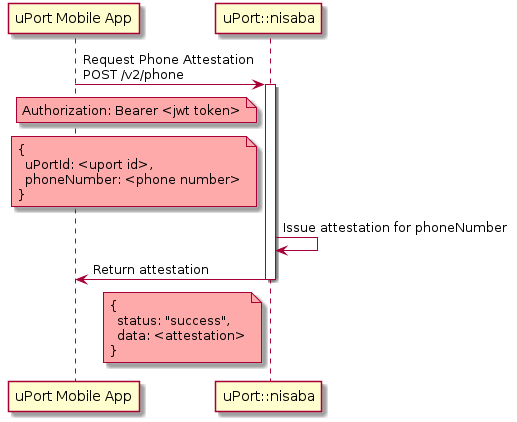

# lambda-nisaba
Lambda functions for verifying phone numbers


[Diagrams](./diagrams/README.md)

## Description
Nisaba provides phone verification for the uPort ecosystem. This is the lamba-function version of it

## API v2

### Request Phone Attestation

The nisaba token / fuel token can be used to get a real uPort phone attestation.

### Endpoint

`POST /v2/phone`

### Headers
```
Authorization: Bearer <nisaba token/fuel token>
```
### Body
```
{
  uPortId: <uport id (mnid)>
}
```


#### Response

| Status |     Message    |                               |
|:------:|----------------|-------------------------------|
| 201    | Ok             | Attestation                   |
| 403    | Forbidden      | JWT token missing or invalid  |
| 500    | Internal Error | Internal error                |

Token stored in `code` is deleted after JWT expiration date

```
{
  'status':  'success',
  'data': <attestation>
}
```

### Sequence Diagram

